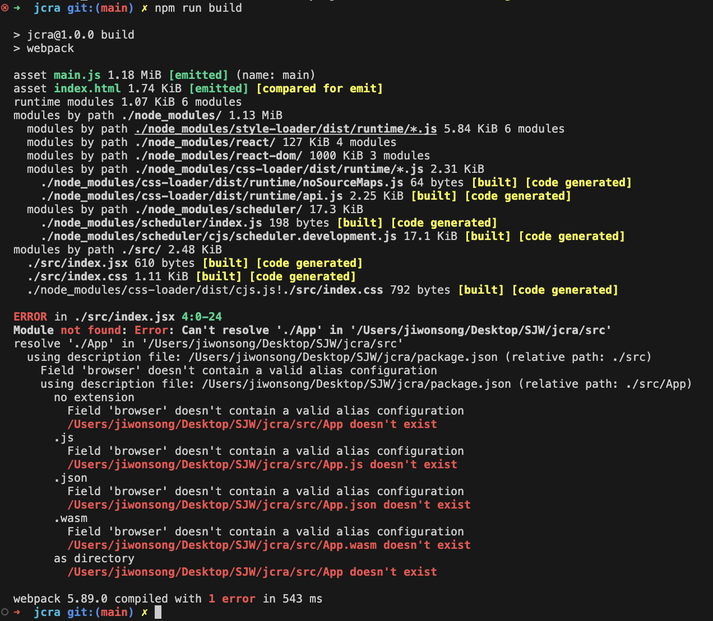

## webpack.config.js 파일내 output 설정에서 path.resolve() 사용하는 이유?

https://p-iknow.netlify.app/node-js/path-moudle/


&nbsp;
&nbsp;


## webpack 플러그인 중 "DefinePlugin"과 "EnvironmentPlugin"의 차이?

- https://webpack.kr/plugins/define-plugin
- https://webpack.kr/plugins/environment-plugin
- ["웹팩(Webpack) DefinePlugin, EnvironmentPlugin 사용법" DaleSeo 블로그](https://www.daleseo.com/webpack-plugins-define-environment/) :good:


&nbsp;
&nbsp;


### DefinePlugin

- DefinePlugin은 모든 자바스크립트 코드에서 접근이 가능한 전역 변수를 선언하기 위해서 사용되는 플러그인
- DefinePlugin으로 선언한 전역 변수는 어디까지나 웹팩이 소스 코드를 빌드하는 동안에만 사용되기 때문에 브라우저 런타임에는 접근이 불가능
  -> 브라우져 콘솔에 정의한 상수 사용 불가
  -> webpack 결과물인 js 파일에 정의한 전역 변수, 정의한 값으로 "대체" 됨!


&nbsp;
&nbsp;


### EnvironmentPlugin

- 노드 런타임(Node runtime)에서 process.env에 저장되는 "환경 변수"를 전역 변수로 등록하기 위한 플러그인

### 정리

[원본 글](https://www.daleseo.com/webpack-plugins-define-environment/#%EB%A7%88%EC%B9%98%EB%A9%B4%EC%84%9C) 

DefinePlugin과 EnvironmentPlugin이 햇갈리시는 분들은 EnvironmentPlugin을 환경 변수 전용 DefinePlugin이라고 생각하시면 이해가 쉬우실 것 같습니다. 따라서 DefinePlugin를 이용해서 EnvironmentPlugin로 할 수 있는 모든 설정을 할 수가 있으며, 단지 EnvironmentPlugin를 사용하는 이유는 설정을 좀 더 간편하게 하기 위함입니다.

예를 들어, 위 실습 예제에서 EnvironmentPlugin로 작성한 아래 설정은

```js
// EnvironmentPlugin
new webpack.EnvironmentPlugin(["DEBUG"]);
new webpack.EnvironmentPlugin({ DEBUG: "on" });
DefinePlugin를 이용해서 다음과 같이 각각 대체할 수 있습니다.
```

```js
// DefinePlugin
new webpack.DefinePlugin({
  "process.env.DEBUG": JSON.stringify(process.env.DEBUG),
});
new webpack.DefinePlugin({
  "process.env.DEBUG": JSON.stringify(process.env.DEBUG) || "on",
});
```


&nbsp;
&nbsp;


### ERROR in ./src/index.jsx Module not found: Error: Can't resolve './App' in  에러

> ERROR in ./src/index.jsx Module not found: Error: Can't resolve './App' in '/Users/jiwonsong/Desktop/SJW/jcra/src'

에러가 발생함.




와 같이 해당 파일에는 문제 없었음

검색해보니, 

-  `import App from "./App"` 처럼 확장자를 명시하지 않으면 webpack 설정 내 `resolve.extensions` 배열 내 정의된 확장자 배열을 대입해봐서 찾아봄
  - 명시하지 않았을때 resolve.extensions 의 디폴트 값은 `['.js', '.json', '.wasm']`
  - 나는 기존까지 `resolve.extensions` 설정을 명시하지 않았으므로, webpack이 index.jsx 내 명시된 `'./App'`을
  - 해당 디렉토리에 존재하는 "App.js", "App.json", "App.wasm" 들을 찾으려하였으나 해당 파일들이 없으니 Module not found 에러를 발생함!


참고한 블로그 : https://velog.io/@yes3427/Webpack-Module-not-found-error

공식 문서 : https://webpack.kr/configuration/resolve/#resolveextensions

webpack 은 확장자가 명시되지 않은 경우, `resolve.extensions` 설정에 명시된 순서대로 확장자를 해석하고
동일한 이름의 파일이지만, 확장자가 다른 경우 webpack은 배열의 앞에서부터 파일을 해석하고 남은 것은 해석하지 않음.


&nbsp;
&nbsp;


## mode 에 대한 설명

https://fgh0296.tistory.com/15 참고


&nbsp;
&nbsp;


## webpack-merge 란?

1.0에서 사용하던 방식이 webpack-merge 였음

- (공통) webpack.common.js
- (dev 환경) webpack.dev.js
- (prod 환경) webpack.prod.js


이렇게 설정 나눠서 사용하는 것

https://fgh0296.tistory.com/15 참고


&nbsp;
&nbsp;


